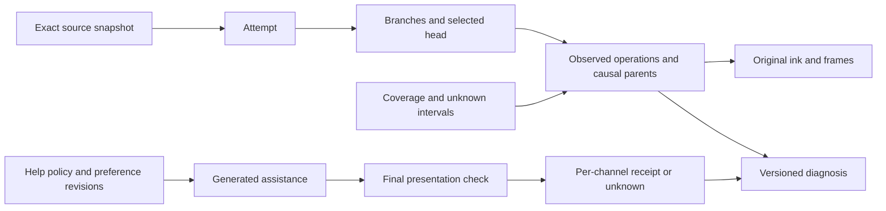

# P0-09 process persistence proposal

Status: **design and synthetic test vectors only**. No new runtime entity, endpoint,
wire field, migration or device capability is implemented by this document.
Specification read at `57aee9cfc86dfa0dcde674d118034063163ddb13` (requirements v1.1).
Task-card coverage correction read at `e8b02c5be9c343c35698dc7d67bb58cfbb5cb3e6`.
Latest specification/task reading baseline: `e43293760c70364584cb597ae01d34a261cc52cf`
(specification content `a2567fa63cdc9c73e9902af57eabf5032a15e5a7`). This extends
the same design delivered in `43a0e81`; it does not replace that delivery.
Implementation branch remains based on backend delivery `803916f`, contract 0.1.0;
the specification was read using `git show`, without merging or resetting work.
Targets: R51/R52/R53/R54/R55/R57/R58/R59 and R46–48;
A30/A31/A34/A37/A38/A40/A42–46 with linked A26–28, supporting G7/G5.

R59 clarifies the original R03/R08/R46–48 classroom goal: stay on the original
live course website/app, write with this product's pen, have AI actually receive
the composed view, retain editable ink and context, add separate necessary AI
supplements, then archive through a verified official Notability flow. An owned
canvas, frozen frame or side-by-side draft is a named fallback. Its success cannot
pass R59/A44 or replace the actual-import evidence required by A46.

P0-04 was delivered with 195 local tests; integration review and real PostgreSQL
verification remain pending. Its existing user-scoped transactions, immutable
records, revision checks and deletion fences are reusable mechanisms, **not** proof
that the new process, preference or disclosure policy is implemented. A P0-04
review correction takes priority over this proposal. P0-08 supplies the future
shared version and implementation assignment. Names below are design vocabulary.

## One archive, linked evidence and independent projections

Reuse the existing authenticated user, session, source snapshot, observation,
frame, original artifact and note revision. Do not create a separate identity or
problem-history store. Original records retain their language and bytes. Immutable
means updates create another version; explicit privacy deletion is still allowed.

| Proposed record | Relationships and immutable evidence | Mutable selection / constraints |
| --- | --- | --- |
| Attempt | Exact question source/version, user, session, entry/surface transitions, previous attempt if explicitly identified, problem identity evidence | Attempt status and selected branch use CAS. Same question across entries stays linked; retry is a new attempt. Ambiguous new-question versus retry stays unconfirmed; do not merge by title/text similarity. |
| Observed operation | Stable operation/event ID, originating device stream incarnation and sequence, explicit causal parents, branch, before/after choice/text/formula/ink states, raw event/frame references, observation class and actor provenance | No overwrite; select/deselect/reselect/edit/write/erase/undo/redo/supersede are new observations where actually captured. Programmatic site changes are not presumed user input. An erase is not privacy deletion. |
| Ink revision | Original opaque bytes, hash, before revision, producing operation, source/frame context | Immutable artifact plus current-head reference; preserve layout and raw pen data. No claim that external-app pixels supply editable strokes. |
| Coverage interval | Device/stream, structured or visual path, observed interval, sequence gaps, missing/stale/blurred interval, clock alignment uncertainty, evidence references | Revised assessment appends a version; absent gap reports do not establish complete capture. Unknown motives remain null/unknown with provenance. |
| Help policy revision | Scope, explicit user request, teaching state, selected step/attempt revision, permitted assistance, revocation generation | CAS head; unrelated to NAV/ASK/WRITE. More permissive changes require a current explicit request. Restriction never silently loses to a stale offline expansion. |
| Assistance evidence | User request scope, permitted disclosure, actual content/version/hash and assistance extent, attempt/step versions, all channel parts, policy/preference binding, delivery attempt and receipt evidence | Generated, committed, queued, dispatched, client-reported displayed/played, partial, denied and unknown are distinct observations. No generated=seen shortcut. |
| Diagnosis revision | Attempt/branch and evidence revision set, candidate earliest evidenced deviation or interval, observation/user statement/inference labels, uncertain reason, supersedes link | CAS diagnosis head; user correction appends evidence and invalidates old derived labels. Old process remains intact. No diagnosis becomes a permanent ability label. |
| Preference revision | User default language/terms/Chinese-hint policy; explicit bounded override with scope and parent default revision | CAS defaults and overrides separately; effective-version tuple recorded on outputs. Original-language text is never rewritten. |
| Surface and composed-view evidence | Exact site/app/device/OS capability evidence, live/frozen/owned mode, source/frame/video/context, ink revision, coordinate transform/viewport epoch, composite artifact hash, actual adapter input receipt | Local overlay appearance, archive commit and AI receipt are distinct. A stored composite is not proof it reached AI; a receipt is not proof of understanding. |
| Export/archive evidence | Exact note and ink revision, independent AI-layer selection, source/context manifest, immutable export hash/format, target, share operation, import evidence and its provenance | Local save, server commit, export ready, share started, pending import, confirmed import, failed and unknown are distinct. No share-sheet=import shortcut or flattened-image=editable-ink claim. |

## Ordering, branches and offline replay

Each originating stream needs a durable incarnation identifier if sequence numbers
can restart after reinstall/reset. Proposed uniqueness combines user, stream
incarnation and device sequence, in addition to stable event ID. P0-08 must decide how this evolves
the current device-sequence contract; backend will not silently reinterpret 0.1.0.

Use explicit causal-parent links and in-stream order. Preserve capture time, server
receive time, source clock/timezone and any measured uncertainty separately. Server
commit order is useful for synchronization cursors but is not a claim of causal or
real-world chronological order. Concurrent branches remain incomparable until an
explicit merge/selection event; UI tie-breaking must not fabricate causality.

Within a branch, a head-changing operation compares its recorded base revision.
Two valid children of one parent can be distinct explicit branches. Two writers
changing one selected head cannot both win the same CAS. A conflict preserves the
already archived original observation; it does not silently choose a winner by
timestamp or invent a branch. Selecting/reconciling branches is another revision.
Cycles, cross-user/attempt parents and changed-content ID reuse must be rejected.

Missing causal parents differ from invalid parents. Proposed ingestion may durably
archive a valid owned envelope while marking its projection unresolved, preserving
the original evidence without manufacturing a predecessor. It must not label the
operation applied or the interval complete. P0-08 must explicitly distinguish
durable-envelope ACK from applied-process ACK before enabling this behavior.
Parent arrival resolves links in a new transaction; malformed/conflicting members
roll back their atomic batch. Retried valid envelopes deduplicate by stable ID and
client-content fingerprint, excluding server receive time; exact ACK sets remain
independent of any largest sequence observed.

Restart rebuilds branch/diagnosis indexes only from retained original events and
explicit corrections, after loading current tombstones and policy generations.
Historical uploads never activate capture or set a newer help permission. A newly
discovered capture gap remains a gap even when the final answer is known.

## Transaction and presentation boundaries

Reuse the P0 user transaction lock initially. Transactions must not wait for model
or network calls. Finer-grained locks need a reviewed ordering and real race tests.

| Transaction | Checks under the same lock as writes | Commit / response meaning |
| --- | --- | --- |
| Archive observed batch | Identity/scope/generation, ownership, IDs/sequences, bytes/hash, deletion, valid relation domain | Original envelopes + exact receipts atomically stored; unresolved relations explicitly separate from applied state. |
| Select branch / correct diagnosis / change preference | Expected head, referenced owned immutable evidence, current lifecycle, user request provenance | Append revision + update one head + increment affected generation + invalidate dependent work atomically. |
| Tighten help / cancel / switch question | Current scope and generation; explicit intent, not pause/erasure inference | Append policy and cancel/invalidate matching jobs/outbox entries atomically. Historical help is retained. |
| Commit derived result | Source/attempt/branch revisions, auth/cancel/deletion generations, effective preference tuple, help policy and request scope | Persist derived result and eligibility metadata; never claim visible or audible. A mismatched fence cannot publish. |
| Authorize outbound channel | Recheck the same binding and current connected target; reject old higher-disclosure cache | Create short-lived, single-use delivery authorization/outbox record; dispatch is separate and is not a receipt. |
| Record presentation receipt | Exact delivery ID/content/channel and authenticated device, duplicate/partial ranges, deletion restrictions | Append reported exposure. A late receipt can describe past exposure without granting current display or replay permission. |

The binding includes user/session, source/version, attempt/revision/branch,
policy revision + explicit request, authorization/deletion/cancel generations,
default preference revision + override revision, content/channel manifest and
target-device state. The lead owns its final representation. Cache keys alone are
not authorization; a cached full solution cannot satisfy a local-step hint request.
Titles, diagrams, notes, notification previews, review snippets and queued audio
use the same check as body text. Learning/QA must assess actual semantic disclosure;
an enum or content hash cannot certify that a hint does not reveal the answer.

The database cannot atomically commit pixels or audio on another device. A server
authorization may race with a later revocation before actual rendering. Client
owners must recheck local intent/versions immediately before every render/play
segment, remove stale visible content where possible, purge queued output on a
newer generation, and suppress answer-bearing output when disconnected or freshness
is uncertain. An unexpired offline token does not prove current permission.
Short leases and online handshakes limit a race window; they do not prove globally
instant revocation. P0-08/P0-11/P0-12 must define and measure that window and the
revocation receipt semantics. Until then, A34/G7 remain unverified. A response
already seen cannot be retracted, and unknown delivery must not be called unseen.

Interrupted audio records the client-reported played prefix/ranges and unconfirmed
remainder. Receipt loss means unknown exposure, so later mastery projections must
not assume unaided work. Delayed exact receipts update history, never re-enqueue
presentation. Manual historical retrieval still passes the current disclosure
policy; a saved full-solution note must not appear automatically during exploration.

For R54/R55/A37, persist the difference between allowed assistance and what content
was actually reported displayed/played. A full-solution permission with only one
hint rendered is not evidence that the full solution was received. Record exact
content segments, their declared/reviewed help extent and classification uncertainty,
the request scope, and linked attempt/step revisions. Cancellation is not proof
that nothing had already appeared. Text visible in a notification or diagram counts
as a channel too, even if its main card was never opened.

Learning receives these facts and provenance: a self-correction observed before any
confirmed help within a known observation window; a correction after a specific
hint; or completion after reported solution exposure. These are evidence patterns,
not automatic causal explanations or independent-mastery labels. Missing receipts
or channels make assistance extent unknown, not zero. User statements about help
are separate from device-reported presentation. Novel-problem independent-transfer
evidence remains separate from helped completion of the same problem. Generated,
cached or queued content without presentation proof is not counted as confirmed
help, but any uncertain dispatch remains an uncertainty for later evaluation.

## Preferences, cancellation and deletion

Default product preference is simple English, original technical terms and brief
Chinese hints where helpful. A Chinese user utterance or Chinese engineering status
does not change it. Proposed precedence is explicit current-question override over
persistent user default, with effective versions saved on each result. An override
ends with its explicit scope, survives a restart only within that scope, and cannot
leak to another attempt or become a global preference by last-write-wins. Explicit
global changes use their own CAS. Stale offline preference changes conflict or
remain unapplied evidence; old clients cannot silently restore a retired override.
The lead must settle whether a repeated attempt belongs to the same override scope.

Withdrawing help is distinct from disabling capture, revoking a source, ending an
attempt and deleting history. Tightening help preserves original observations and
truthful assistance receipts, while fencing future presentation. Ordinary undo
preserves before/after originals. Privacy deletion traverses attempt operations,
ink/frame references, derived diagnosis/mastery links, generated help, replay caches
and outgoing queues; shared original sources survive unless separately deleted.
Delete a shared blob only when no retained original record references it. Ambiguous
ownership/reference sets block deletion completion rather than silently discard
unrelated course records.

The deletion transaction writes minimal ID/generation tombstones first and removes
accessible content/projections and pending delivery payloads atomically. Follow-up
object-store/index/client cleanup must be tracked, with late uploads, receipts,
rebuilds and old backups fenced; no claim of cross-device erasure before receipts.
Tombstones contain no original text/ink or unnecessary content fingerprints. A late
receipt for erased content may retain only an allowed non-content status and must
not restore the content. Storage-retention/backup-erasure policy remains a lead
decision before production; a database rollback must never revive erased records.

## Multiple entries, live-screen ink and the complete archive path

The following is a proposed evidence matrix, not a platform support report.
Capability results must identify the actual website/app, document/origin/frame,
device/OS, capture mode and measured limitations; a grant alone is not validation.

| Entry | Persist only evidence actually available | Unknown / separate boundary |
| --- | --- | --- |
| Website single/multiple choice | Before/after observed selection, stable question/option locator and version, observed select/deselect/reselect event, source/time | Final selected option cannot reconstruct missed transitions or explain reasoning. |
| Website text/formula editor | Authorized observed input/change and before/after content, editor and document version, attribution evidence | DOM value change may be programmatic; keystrokes, hidden formula state, canvas, shadow root and cross-origin iframe history require separate proof. |
| Website handwriting tool | Exposed authorized operation log if verified, otherwise the observed pixels and coverage | Not this product's pen. No inferred strokes/undo history from final pixels. |
| External notes app's pen | Original observed frame and visual-change interval with app provenance | Visual evidence is not an editable stroke file or complete internal history. |
| This product's live website overlay | Own editable ink/op history, original live page context and composed-view receipt chain | Verify each site, frame, fullscreen and input path; local visibility alone is insufficient for A44. |
| This product's Windows desktop layer | Expected own ink and original-window/composed-frame evidence when implemented | P3 separate validation; web results do not establish desktop capture or input routing. |
| This product's iPad/iPhone native-app layer | Only independently verified public-platform live overlay/ink/composite evidence | Unverified or evidenced unsupported per app/OS; no universal overlay assumption. |
| Owned/frozen/side-by-side draft | Original retained context, exact frozen source/frame, own editable ink and explicit fallback choice | Separate A45 outcome; never promote to original-live-screen R59/A44. |

An entry transition appends evidence linking its prior and next surface to the same
confirmed question/attempt, with explicit causal references where known. A retry
creates a new attempt linked to the old one; a new question changes the question
binding. If an iframe navigates or a site reuses a DOM node for another question,
invalidate the old locator epoch before associating new input. Missing identity or
transition evidence remains unresolved and can prompt minimal clarification.

User-origin input, website-provided answer/grading feedback and application AI help
are separate provenance categories. Website feedback keeps its publisher/source,
question version, first-observed visible interval and receipt uncertainty. Site
feedback can affect later learning evidence without being mislabeled as an AI
AssistanceEvent or the user's reasoning. Programmatic autofill of unknown origin
is recorded as unknown attribution; do not label it user-authored by default.
A correct option after site feedback with no reason does not prove independent
mastery. Observation supplies no authority to click, fill, submit or send homework.
These distinctions need future shared contract support; do not insert a new actor
enum into existing 0.1.0 Observation records.

For live ink, bind each segment to its original source/version and question,
frame/video position, coordinate-space definition, viewport/scroll/zoom epoch,
and the transform evidence used for placement. Keep intrinsic geometry and the
original editable bytes separate from a flattened display. A verified transform
can generate a new rendering while leaving original coordinates unchanged.
Unverifiable reflow, zoom, viewport rotation, iframe navigation or question switch
freezes the old anchor and marks the new placement unresolved; it must not silently
move old ink onto a new question. Saving a new context segment is not rewriting an
old one. Product clients must separately verify normal navigation and pen input.

Persist a receipt chain tying the exact composed artifact to its base frame, ink
revision and included AI layers: local composition, backend receipt/storage, then
the actual AI adapter input manifest/receipt. Local render or archive ACK alone
does not prove the model received the overlay; a model's textual claim to see it
is not a substitute for input evidence. A blank-overlay remote frame exposes a
capture/composition gap even when local ink is correctly stored. This design
enables evidence collection; it does not verify any renderer or actual AI call.
If a provider offers no per-artifact receipt, preserve the real request manifest
and response/transport evidence with its limits; do not invent stronger receipts.
Input delivery does not itself prove correct visual recognition or understanding.

An explicit share stop advances a capture generation and closes its live coverage.
Clients stop new realtime transmissions; backend live ingestion and dependent jobs
reject the retired generation and never label its last frame current. Separately
authorized historical synchronization may retain pre-stop originals with their
historical capture time and state, without broadcasting them as current or restarting
capture. Validate the recorded stream authorization and stop fence; a client-supplied
`historical` flag or wall timestamp cannot bypass it. Where ordering against stop
cannot be established, retain uncertainty and exclude the record from live work.
Help withdrawal, capture stop and history deletion remain separate actions.
Remote stop effectiveness still requires per-device acknowledgement; storage cannot
retroactively prevent already transmitted media.

The A46 chain preserves independent evidence at every stage:

1. Original-live-screen operation and AI composed-view receipt (A44), with supported
   path/capability evidence; a fallback leaves this criterion unpassed.
2. Local original-ink save and, separately, server persistence of exact revisions,
   frame/source/video context and immutable byte hashes. AI diagrams/formulas/text
   are independent layers with help-policy and actual-presentation evidence.
3. Export an immutable render of a pinned note revision, layer selection and source
   manifest. Editing the note later cannot mutate the exported file or its receipt.
   PDF/PNG are flattened formats, not Notability-native editable strokes. The app
   retains its editable original even if the export/import fails.
4. Follow a supported official share/import path. A share sheet opening is only
   share-started; selection/completion callbacks prove only what they document.
   Keep pending-import or unknown until actual target evidence is available.
5. Record actual import evidence (target/app/version, observed imported artifact,
   corresponding export hash/revision, evidence time and verification method).
   A user attestation is labeled as such, not fabricated machine confirmation.
   No automatic receipt/query/write API is presumed to exist for Notability.

Export preparation is idempotent for user + note revision + selected layers +
format + target. Each external share attempt has a separate identity and evidence;
a missing response is not a safe reason to send another copy. Unknown target
outcomes require reconciliation using supported observation/query or an explicit
user confirmation step. If none is available, retain unknown and surface that exact
limitation; do not guess success or failure. A late import receipt binds to its
original exported revision and cannot advance the current note or help policy.

Deleting a local note cancels pending exports and purges local derived files/cache
under its deletion fence; it cannot claim deletion from an external Notability
library without a verified supported path. Report remaining external copies/status
separately. Imported PDFs remain distinct from original editable ink. Successful
export or import never fills an unverified A44 gap, and A45 success is tracked
independently. Platform/QA must test the full chain on a real supported device.

## Deterministic vectors and future verification

[p0-09-transaction-vectors.json](p0-09-transaction-vectors.json) contains synthetic
declarative schedules and expected outcomes. The numbered schedule is an injected
test interleaving, **not** timestamp-derived process order. They are neither wire
messages nor executable protocol tests. Static consistency checks are recorded in
[p0-09-evidence.md](p0-09-evidence.md); no runtime policy PASS is inferred.

After P0-08, implement deterministic domain checks using these schedules, then
run independent PostgreSQL connections with barriers before the decisive locked
read and commit. Verify both possible serial winners for concurrent operations:
event/receipt dedupe, head CAS, help-withdrawal versus outbox commit, deletion versus
rebuild/late upload, and preference override versus queued result. Kill/restart only
an expendable test worker between commit and ACK to test durable replay. Migration
apply/reapply/rollback compatibility belongs in a dedicated disposable database;
backup restore/erasure requires a separate controlled test. None has run here.

For G7 use human-reference traces on each site/input/capture path in the matrix,
including mixed entries and the product's original-live-screen overlay. Record
retained/lost steps, branch accuracy, anchor placement, composite input receipts,
unknown intervals, latency segments and actual shown/played content. Owned/frozen
canvas results are separate fallback evidence. No Notability undo-stack or Pencil
history capability is assumed from screen sharing. Synthetic rules do not establish
mathematical correctness, semantic restraint, device behavior or learning efficacy.

## Concrete dependencies for the lead

1. P0-08 versioned entity/link and transport definitions, including stream
   incarnation, unresolved-parent ACK semantics, exact batch/CAS receipts, legacy
   0.1.0 compatibility and unsupported-capability responses. Preserve old notes and
   original artifact identities; do not treat missing new fields as permission.
2. Help-policy scope/revision rules, concurrent restrictive versus expansive intent,
   multi-channel eligibility, outbox/presentation receipt vocabulary, disconnected
   behavior and revocation effectiveness bounds agreed with web/iOS. Bind explicit
   actions to authenticated intent; archive bytes are not presentation authority.
3. Preference scope identity, inheritance/expiry and whether an override follows a
   repeated attempt; diagnosis correction and assistance-aware evidence contracts
   agreed with learning. Ambiguity is not an excuse to modify persistent defaults.
4. Deletion graph ownership, shared-source/blob rules, retention and sync tombstone
   horizon, late-receipt policy and backup restoration fences; backend authors the
   reviewed migration only after the compatible shared contract is committed.
5. P0-10 labeled cases and P0-11/P0-12 measured coverage/presentation constraints.
   At the inspected specification commit these deliveries are not present in the
   platform/learning/web verification trees; do not invent their conclusions.
6. Dedicated PostgreSQL test DSN plus runnable/device conditions. P0-04's missing
   DSN remains unchanged. No new account, paid executor or deployment is requested
   or enabled by this design.
7. Surface/question/locator epochs and causal entry transitions, distinct website
   feedback versus user/AI attribution, original-live versus fallback identity,
   geometric transform and composed-input receipt references, immutable export and
   actual-import evidence. Coordinate these with platform/web before migration;
   the backend cannot infer a missing capture event or invent a Notability API.
